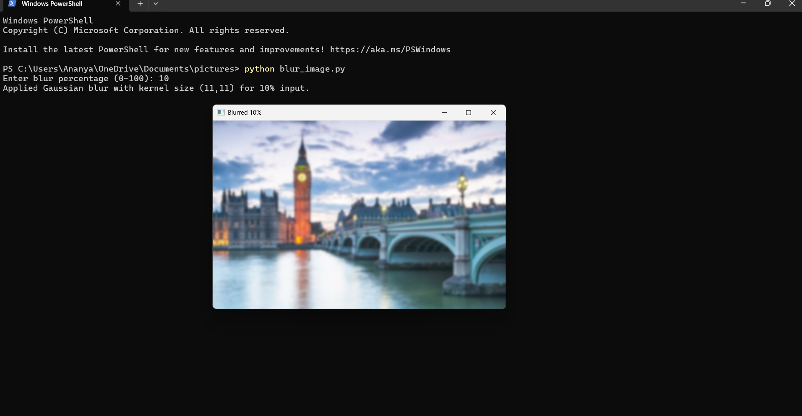

# 🖼️ Image Blur Percentage Tool (Python + OpenCV)

This project allows you to blur any image by entering a **percentage (0–100%)**.  
It uses **Python** and **OpenCV** to apply Gaussian blur based on the percentage you give.

---

## 📂 working Structure

### Usage 

To blur an image by giving any blur percentage (0–100%).

 
